# NeonBench User Manual

NeonBench turns artwork and lettering into **production-ready neon tube patterns**: it
vectorizes a drawing into glass-tube centerlines, lets you mark every bend, electrode,
support and block-out the bender needs, validates the layout against real neon
engineering rules, prints the shop pattern, exports CAD, and renders a glowing 3D
preview so the customer can sign off before a single tube is bent.

This manual has two parts:

- **[Part 1 — Feature reference](#part-1--feature-reference):** every screen, panel and tool.
- **[Part 2 — Walkthrough: building & rendering a cursive "Salon" sign](#part-2--walkthrough-building--rendering-a-cursive-salon-sign):**
  a complete worked example that exercises every neon feature, built end-to-end in the app.

All screenshots in this manual were captured from the running application against the
project **"Salon"** that Part 2 builds.

---

## Part 1 — Feature reference

### 1. Projects

The home screen lists every project, most-recently-updated first.

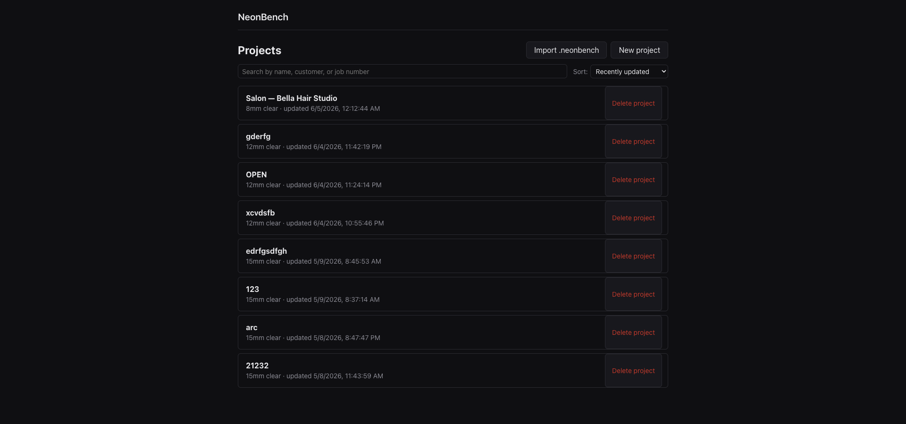

| Control | What it does |
|---|---|
| **New project** | Opens the new-project dialog (name, tube spec, optional customer / designer / due date / job number). |
| **Import .neonbench** | Restores a project from a portable `.neonbench` archive (see *Export bundle*). |
| **Search projects** | Filters the list by name as you type. |
| **Sort** | *Recently updated*, *Due date (next first)*, or *Name (A–Z)*. |
| **Delete project** | Removes a project and all its design versions. This is permanent. |

Each card shows the project's default tube spec and last-updated time. Click a card to open it.

#### New-project dialog

- **Name** (required).
- **Tube spec** — the glass you'll build in. Ships with `8mm`, `10mm`, `12mm` (default) and
  `15mm` clear. The spec sets the **minimum bend radius** and segment limits the validator
  enforces (e.g. 12 mm → min bend 27 mm; 8 mm → min bend 18 mm).
- **Tube end gap (mm)** — optional override of the default electrode-to-electrode end gap.
- **Customer / Designer / Due date / Job number** — optional job metadata, all editable later.

### 2. Project detail

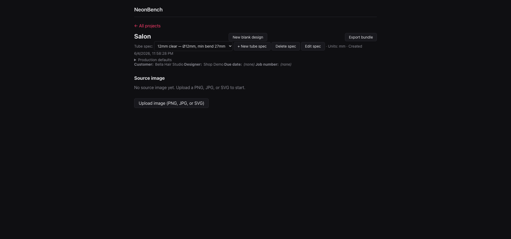

The project page is the hub for one sign:

- **New blank design** — opens the editor on an empty 1000 × 500 mm canvas to draw from scratch.
- **Export bundle** — downloads a portable `.neonbench` archive (every design version's SVG +
  design doc + validation report, plus a manifest). This is the round-trip format for
  *Import .neonbench*.
- **Tube spec** selector + **New tube spec / Edit spec / Delete spec** — manage the glass
  library for this project. Editing a spec re-validates every version that uses it. A spec in
  use by any project can't be deleted until those projects switch away.
- **Production defaults** (collapsible) — shop defaults that drive the print PDF and channel-letter
  math:
  - **Tube end gap (mm)** — default 6.35 mm (¼ in): endpoint-to-substrate distance.
  - **Channel letter depth (mm)** — default 100 mm (≈ 4 in): height of the return strip.
  - **Strip overlap (mm)** — default 12.7 mm (½ in): seam allowance on the unfolded strip.
  - **Strict mode** — when on, a channel-letter face whose perimeter exceeds the standard
    1168 mm blank length becomes a hard **error**; off (default) it's a warning so the shop can
    splice through a documented seam.
- **Customer / Designer / Due date / Job number** — inline-editable job metadata.
- **Source image** — upload a PNG, JPG or SVG to vectorize (see next).
- **3D preview** + **Download vector** (DXF / SVG / EPS / AI) links appear per design version.

### 3. Vectorize (image → tubes)

Uploading a source image opens the **Vectorize** panel, which traces the artwork to single-stroke
tube centerlines. Controls:

- **Image adjustments** — rotate (manual angle or *auto-level* skew estimate), brightness,
  contrast, and per-channel luminance weights (default Rec. 601 0.299 / 0.587 / 0.114; tilt
  toward a channel for tinted source photos).
- **Crop (source pixels)** — restrict tracing to a region.
- **Binarized preview** — live preview of the black/white image the tracer will skeletonize.
- **Advanced centerline options**:
  - **RDP tolerance (mm)** — Ramer–Douglas–Peucker simplification; higher = fewer vertices,
    rounder corners. Blank = auto from tube diameter.
  - **Min branch length (mm)** — prune skeleton spurs shorter than this. Blank = ≈ 2× tube diameter.

The result lands in the editor as editable tube runs.

### 4. The editor

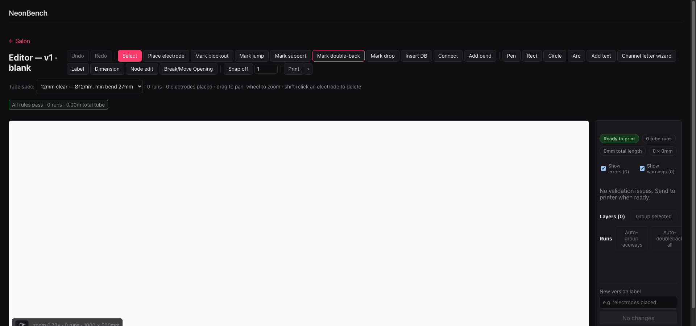

The editor is the core workspace. The canvas pans by dragging and zooms with the mouse wheel; the
**Fit** button reframes the design. **Snap** (toggle + grid-spacing field) constrains new points to a
grid. **Undo / Redo** cover every edit.

The status line under the toolbar always shows the live tally: run count, electrodes placed, and the
validation summary (`N errors · M warnings · K runs · X.XXm total tube`).

#### 4.1 Toolbar tools

**Selection & geometry editing**

| Tool | Description |
|---|---|
| **Select** | Click runs to highlight. With runs selected, drag the **resize handles** (see 4.2). Shift/Alt-drag rubber-bands a marquee. |
| **Node edit** | Edit polyline vertices on the selected run — drag to move, shift-click to delete. Also used to *join* two open runs (arm Head/Tail in the run panel, then click the other endpoint). |
| **Break/Move Opening** *(O)* | Click a vertex on a closed run to insert an opening; on an open run to move the existing opening. |

**Drawing**

| Tool | Description |
|---|---|
| **Pen** | Freeform polyline — click to drop vertices, double-click / Enter to commit, Esc to cancel. |
| **Rect** | Axis-aligned rectangle, dragged corner to corner. |
| **Circle** | Circle, dragged from center to radius. |
| **Arc** | Three-point circular arc (click start, mid, end). |
| **Add text** | Insert Hershey single-stroke text as new tube runs (see 4.3). |
| **Channel letter wizard** | Generate a full channel-letter pattern from text — face outlines + parallel tubes, optional raceway split. |
| **Label** | Drop a text label anywhere on the canvas (annotation, not tube). |
| **Dimension** | Measure a distance between two clicked points. |

**Neon construction marks** — these are what make a drawing buildable as glass:

| Tool | Description |
|---|---|
| **Place electrode** | Click on a path to set an electrode (the high-voltage terminal). An open run takes two — head and tail. |
| **Connect** *(C)* | Click two electrode pins on different runs to commit a jumper run between them. Esc / right-click cancels. |
| **Mark blockout** | Click **two** points on the **same** run to paint a block-out span (opaque paint that hides tube where it shouldn't read, e.g. a connecting lead or a crossing). |
| **Mark jump** | Mark a jump-over — the tube lifts to clear another tube. |
| **Mark support** | Mark a support point (chassis / tube-support mount). |
| **Mark double-back** | Tag a hairpin as an intentional double-back, which suppresses the bend-radius warning there. |
| **Mark drop** | Mark a drop bend (tube briefly dips behind the substrate; logged as a DROP in the bend list and a subtle dip in 3D). |
| **Insert DB** | Splice a U-shaped hairpin (double-back) into a polyline at the click point — default depth 1.5× tube ø, shift-click to flip side. |
| **Add bend** | Add a manual bend point, overriding auto-detection for that run. |

#### 4.2 Resize handles

With one or more runs selected, a dashed bounding box appears with **eight handles** (corners +
edge midpoints). Drag any handle to scale the selection live; hold **Shift** for uniform scaling.
The validation re-runs continuously as you drag, so you can watch errors clear (or appear) in real
time. Scaling is a single undo step.

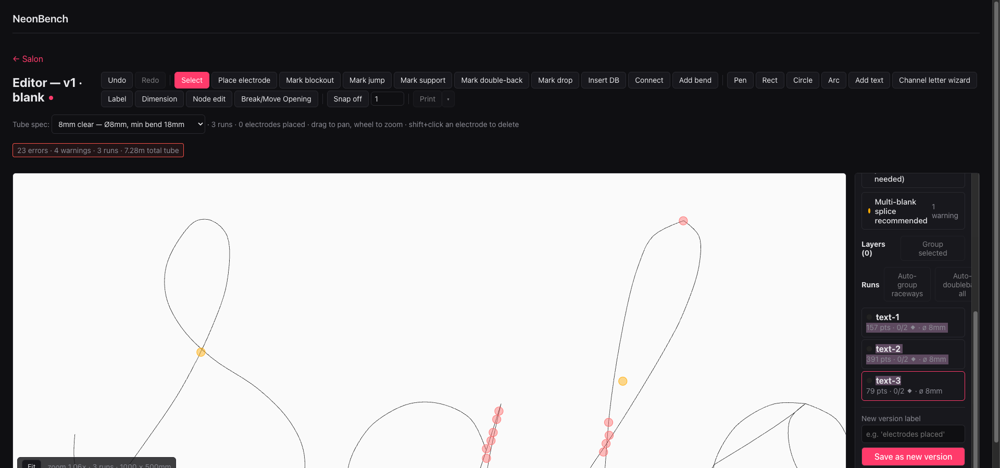

#### 4.3 Add-text dialog

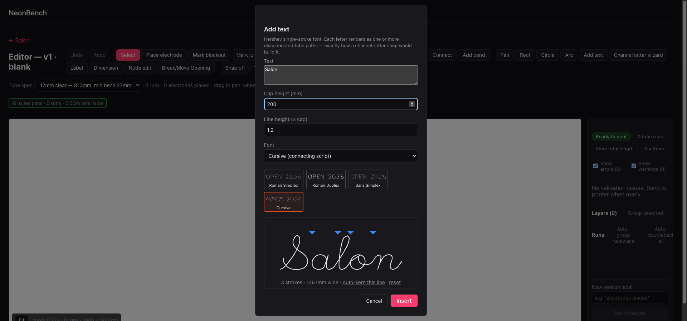

- **Text** — multi-line supported.
- **Cap height (mm)** and **Line height (× cap)**.
- **Font** — *Roman Simplex* (default), *Roman Duplex* (thicker), *Sans Simplex (Futural)*, and
  **Cursive (connecting script)**.
- **Kerning** — drag the kerning slots between letters to hand-kern (horizontal) or baseline-shift
  (vertical) the next glyph; **Auto-kern this line** and **reset** are one-click. The preview shows
  the live stroke count and overall width.

Each glyph renders as one or more **disconnected tube paths**, exactly how a channel-letter shop
would build it.

#### 4.4 Run properties

Selecting a single run opens its property panel:

- **Color** — the gas / phosphor color (full table in [Appendix A](#appendix-a--gas--phosphor-colors)).
  Drives the 3D glow color.
- **Diameter (mm)** — editor-only per-run override (validation still uses the project tube spec).
- **Notes** — free text, e.g. `15kV @ 60mA, GTO HV cable, argon+phosphor`.
- **Channel letter face** — marks the run's polyline as a face silhouette; the print PDF then adds a
  return-strip page (perimeter × depth) with bend marks at every vertex. Optional **per-run depth**
  and **raceway** label (runs sharing a raceway value print as one combined unfolded strip).
- **Path ops** — **Simplify** (RDP at ε mm), **Reverse** (flip polyline + electrode anchors),
  **Neonize** (offset the outline into a parallel tube pair), and **stitch ends** (join outer+inner
  offsets into one run via hairpins).
- **Join from: Head / Tail** — arm an endpoint, then click another open run's endpoint (node tool) to
  merge two runs.
- **Bends** — the per-run bend list (position, angle, radius), each removable.

#### 4.5 Layers, groups & batch run ops

- **Layers / Group selected** — bind selected runs into a named group; selecting any member selects
  all, and color/diameter/delete apply to the whole group. Double-click a layer to rename;
  *Ungroup* dissolves it.
- **Runs** panel batch actions:
  - **Auto-group raceways** — cluster channel-letter faces by baseline + proximity and assign
    deterministic `raceway-1, raceway-2, …` IDs left-to-right.
  - **Auto-doubleback all** — insert a double-back hairpin at every open-run electrode termination
    (idempotent).
  - **Auto-housing all** — apply a housing (15-/19-shell / custom) to every electrode without one.

#### 4.6 Validation

NeonBench validates continuously and groups issues by rule. Toggle **Show errors** / **Show
warnings** to filter both the list and the on-canvas markers; click a group to jump to its markers.

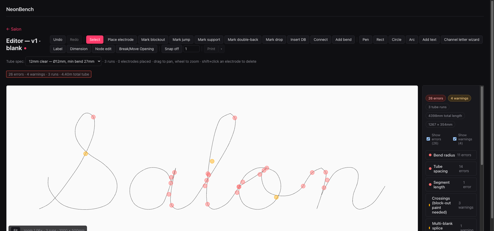

| Rule | Level | Meaning |
|---|---|---|
| **min_bend_radius** | error | A bend is tighter than the tube's minimum radius (cracks the glass). Mark a genuine hairpin as a **double-back** to clear it, or relax the curve. |
| **min_spacing** | error | Two tubes run closer than the minimum gap (they'd fuse / arc). |
| **max_segment_length** | error | A single continuous tube exceeds the max length (here 2500 mm) — split it into separate glass sections. *Note: electrodes alone don't clear this; the run must be physically split.* |
| **crossing_needs_blockout** | warning | Two tubes cross — the crossing needs block-out paint so only one reads. Mark block-out over the crossing to resolve. |
| **splice_recommended** | warning | A tall design (≥ 305 mm) should use multi-blank construction with internal welds (Miller 1935). |
| **electrode lead-in / min_lead_in** | warning | The straight lead-in at an electrode is too short (where an electrode will sit). |

#### 4.7 Versions

Type a label in **New version label** and click **Save as new version** to snapshot the design. Each
version has its own 3D preview and export. Versions can be renamed later from the project page.

#### 4.8 Printing & export

**Print** generates the shop PDF. The **Print options** popover sets:

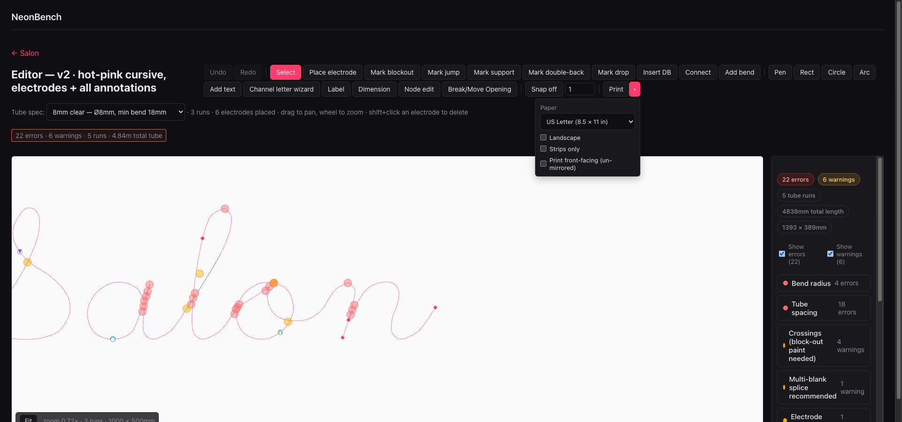

- **Paper** — US Letter / A4 / A3, etc.
- **Landscape**.
- **Strips only** — skip the pattern + bend-list pages and print only channel-letter return strips.
- **Print front-facing (un-mirrored)** — flip for face-up vs. read-through bending.

**Export formats** (from the project page): **DXF** (feeds CNC tube benders), **SVG / EPS / AI**
(feed Illustrator / CorelDRAW / Inkscape), and the **.neonbench** bundle (full project archive).

### 5. 3D preview

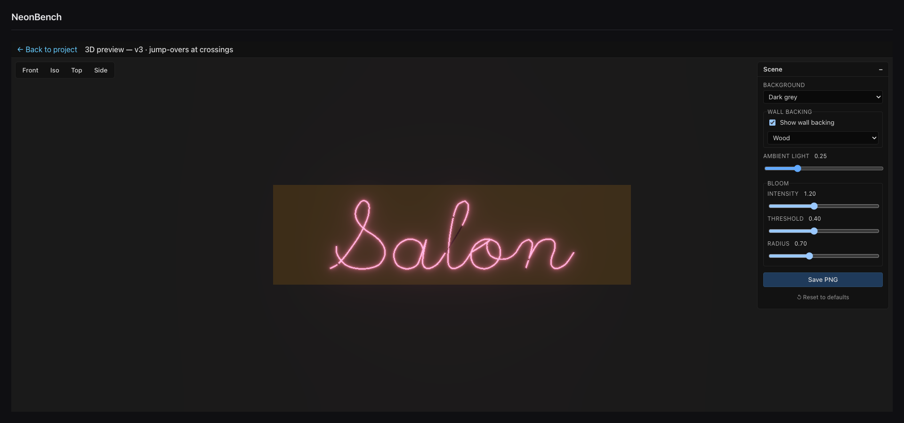

A read-only glowing render of any saved version, available regardless of validation state.

- **Camera presets** — **Front**, **Iso**, **Top**, **Side**. You can also orbit / zoom freely.
- **Background** — Black / Dark grey / Neutral grey / White.
- **Wall backing** — toggle on/off (**off by default**) and pick **White / Steel grey / Black /
  Wood**. Tubes stand off the wall at a realistic depth, casting glow onto it.
- **Ambient light** — fill level (0–1).
- **Bloom** — **Intensity**, **Threshold** (which brightness starts to bloom) and **Radius** —
  this is the neon glow halo.
- **Save PNG** — exports the current view at full canvas resolution.
- **Reset to defaults**.

> **Depth at crossings.** The preview only lifts a tube in Z where a **jump** is marked (and dips
> where a **drop** is marked — see §4.1). It does **not** auto-lift at detected crossings. So
> wherever two tubes cross, mark a **jump-over** on one of them — otherwise the two render coplanar
> and the glass appears to pass *through* the other tube instead of *over* it. The **Side** camera is
> the quickest way to confirm a jump lifted (it shows the standoff profile).

---

## Part 2 — Walkthrough: building & rendering a cursive "Salon" sign

This walkthrough builds a complete, fully-featured sign — cursive lettering, gas color, electrodes,
block-out, double-backs, supports, jumps, drops and bends — then validates and renders it. Every
screenshot above the line and below comes from this exact build.

### Step 1 — Create the project

From the home screen, **New project** → name it **Salon**, customer *Bella Hair Studio*. We'll
build it in fine script, so we use a small tube. Open the project and click **New blank design**.

### Step 2 — Set the script lettering

In the editor, **Add text**:

- **Text:** `Salon`
- **Cap height:** 220 mm
- **Font:** **Cursive (connecting script)**

The preview shows three connected strokes spanning ~1.4 m. Click **Insert**.

> **Tube choice matters for script.** Connected cursive packs tubes tightly, so we switched the
> project to the **8 mm** spec (min bend 18 mm) — the realistic glass for fine script. On the
> default 12 mm spec the same word reports far more bend/spacing errors. Switching the project spec
> *before* inserting seeds each run at the right diameter.

### Step 3 — Read the validation

Straight out of the font, NeonBench flags the layout honestly:

The issues group into **Bend radius**, **Tube spacing**, **Segment length**, **Crossings** and
**Splice recommended**. This is expected and instructive — a stock cursive font isn't drawn to neon
tube-spacing rules, so the validator catches the crowding a production artist would normally redraw.

### Step 4 — Color the gas

Select each stroke run and set **Color → Hot Pink** — a classic salon look. The runs turn pink in
the editor and will glow pink in 3D.

### Step 5 — Place electrodes

With **Place electrode**, click each run's two ends to set head/tail terminals; we also drop one
mid-run electrode on the long stroke. (The long stroke still trips **max_segment_length** — a 3 m
continuous tube exceeds the 2.5 m single-tube max and would be physically split into two sections at
fabrication. NeonBench correctly keeps flagging it; electrodes alone don't divide the glass.)

### Step 6 — Apply the remaining neon marks

Using the construction-mark tools, we add one of each so the pattern is fully annotated:

- **Mark blockout** — a painted span on the long stroke (two clicks bracket it).
- **Mark jump** — at **each tube crossing**. Connected cursive crosses itself (the validator flags
  four crossings here); a jump-over lifts one tube in Z so it passes *over* the other in 3D instead
  of through it. *Tip:* hide the warning/error markers (the **Show warnings/errors** toggles) first
  so the marker glyphs don't intercept the click, then click right on the crossing.
- **Mark double-back**, **Mark support**, **Mark drop** — one each on sensible spots.
- The script's curves already auto-generate bends (21 on the long stroke); **Add bend** drops an
  explicit one.

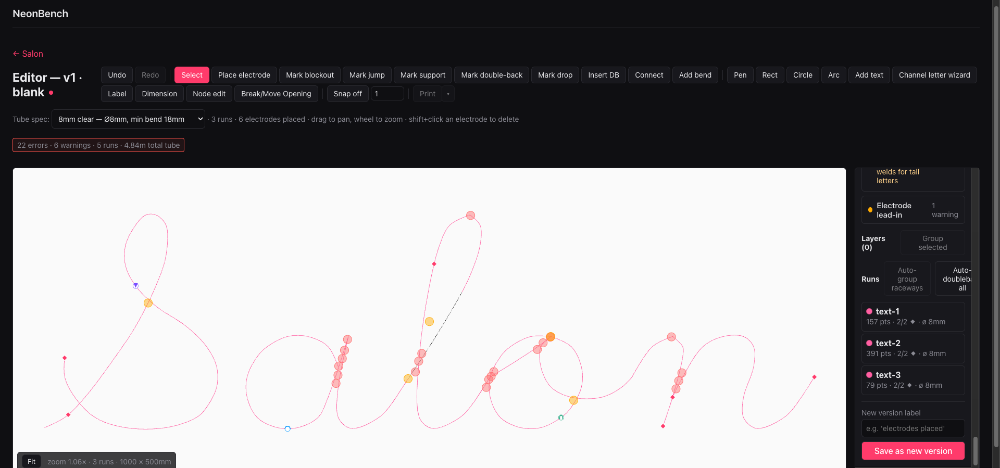

You can see the electrodes (orange/yellow pins), the block-out span (clustered marks near the *a*),
and the jump / support / double-back / drop glyphs along the strokes. Click **Save as new version**
and label it (here: *hot-pink cursive, electrodes + all annotations*).

> **On the residual flags.** A handful of **tube-spacing** errors remain where the connecting script
> nearly overlaps itself — points where two strokes sit < 10 mm apart. These are inherent to a
> connected cursive font: in real glass the bender forms those as one continuous tube or relies on
> the marked block-out. The validator surfaces them for the operator's judgment rather than hiding
> them; that honesty is the point.

### Step 7 — Render in 3D

Open **3D preview** for the saved version. **Bloom** is on by default; **wall backing is off** — turn
on **Show wall backing** and pick **Wood** for a storefront look. Choose the **Front** camera for a
readable hero, or **Iso** for an installed-on-the-wall angle. Because we marked a jump-over at every
crossing in Step 6, the tube lifts *over* itself at each one rather than rendering as glass through
glass:

| Front (hero) | Iso (installed angle) |
|---|---|
|  | 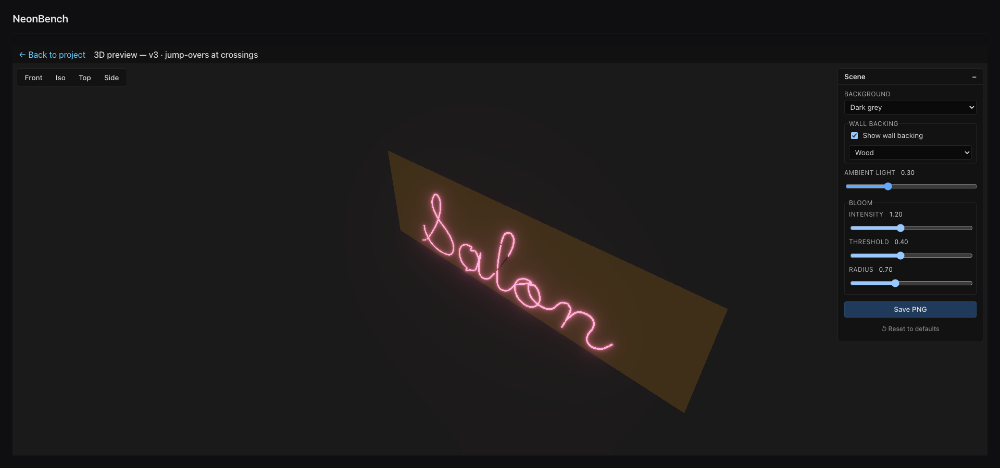 |

Tune **Bloom intensity / threshold / radius** and **Ambient light** to taste, then **Save PNG** for a
full-resolution render to send the customer:

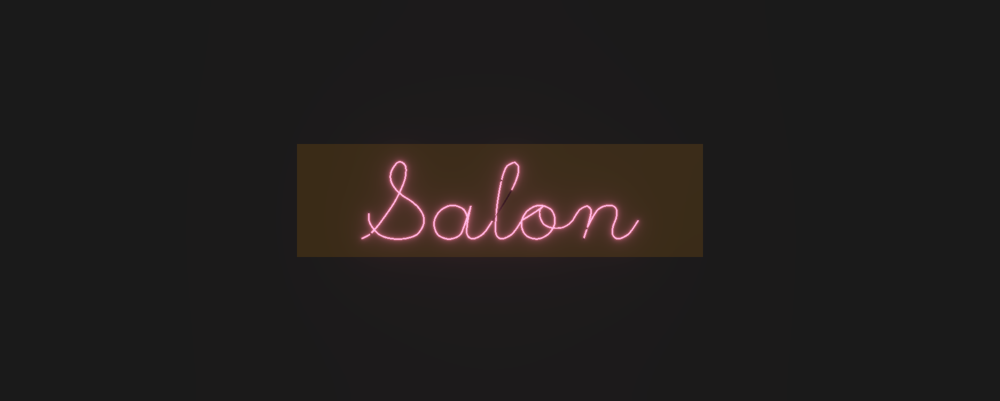

### Step 8 — Print & hand off

Back in the editor, **Print** (with **Print options** for paper / landscape / strips-only /
front-facing) produces the shop pattern PDF. From the project page, **Download vector → DXF** feeds a
CNC tube bender, and **Export bundle** archives the whole job as `.neonbench`.

That's the full path: artwork → tubes → marks → validation → customer render → shop output.

---

## Appendix A — Gas / phosphor colors

The **Color** dropdown on a run sets both the documentation color and the 3D emissive glow:

| Label | Notes |
|---|---|
| — Unassigned | No color set (renders neutral). |
| Classic Red (Ne) | Pure neon. |
| Ruby Red | |
| Hot Pink | Used in the Salon build. |
| Orange | |
| Yellow | |
| Green | |
| Aqua | |
| Blue (Ar/Hg) | Argon / mercury. |
| Purple | |
| White (Ar+phos) | Argon + phosphor coating. |

## Appendix B — Keyboard shortcuts

| Key | Action |
|---|---|
| **Cmd/Ctrl + Z** | Undo |
| **Cmd/Ctrl + Shift + Z** / **Cmd/Ctrl + Y** | Redo |
| **Cmd/Ctrl + A** | Select all runs |
| **Delete / Backspace** | Delete selected runs |
| **O** | Break/Move Opening tool |
| **C** | Connect tool |
| **J** / **]** , **K** / **[** | Cycle selection to next / previous run |
| **Shift** (while resizing) | Uniform scale |
| **Esc** | Cancel the current tool action / staged point |
| **Enter** | Commit a pen polyline |

---

*Generated with screenshots from a live NeonBench session. To reproduce, build the "Salon" project
following Part 2.*
